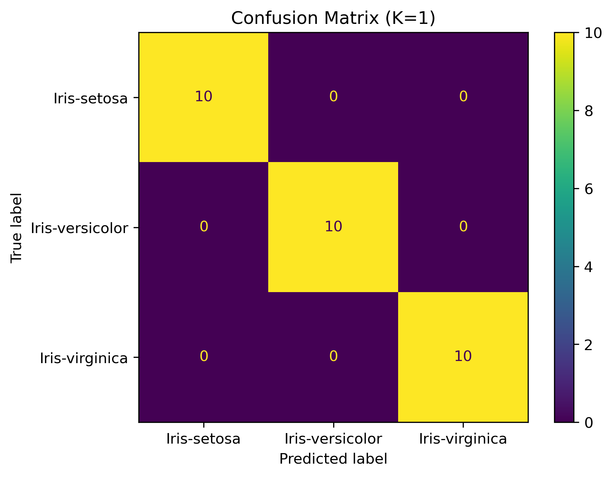
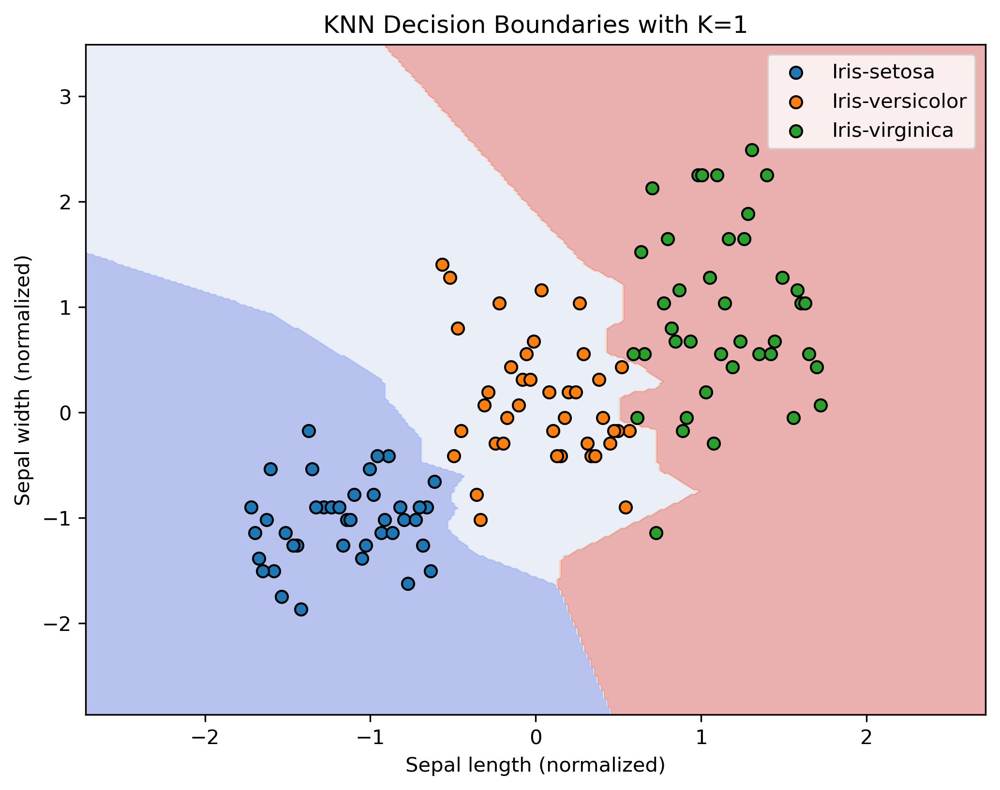

# ElevateLabs_AI-ML_TASK-06
K-Nearest Neighbors (KNN) Classification 
#  K-Nearest Neighbors (KNN) Classification - Iris Dataset 

This project implements a K-Nearest Neighbors (KNN) classifier to classify species in the classic **Iris dataset** using **Scikit-learn**, **Pandas**, and **Matplotlib**.

---

## Objective

- Understand **Instance-Based Learning (IBL)**
- Explore the effect of **K selection** on model performance
- Visualize **decision boundaries**
- Evaluate classifier using **accuracy** and **confusion matrix**

---

## Dataset

- **Source**: [Iris Dataset on Kaggle](https://www.kaggle.com/datasets/uciml/iris)
- Samples: 150
- Features: Sepal length, Sepal width, Petal length, Petal width
- Classes: `Setosa`, `Versicolor`, `Virginica`

---

## Tools & Libraries

- Python
- Scikit-learn
- Pandas
- NumPy
- Matplotlib

---

## Steps Performed

1. **Data Loading** and preprocessing
2. **Feature Normalization** using StandardScaler
3. **Train-Test Split** (80% training, 20% testing)
4. **Model Training** with KNN (`KNeighborsClassifier`)
5. **K Selection**: Experimented with K = 1, 3, 5, 7, 9, 11
6. **Evaluation** using accuracy and confusion matrix
7. **Decision Boundary Visualization** (using first two features)

---

## Model Performance

| K Value | Accuracy |
|---------|----------|
| 1       | 100%     |
| 3       | 100%     |
| 5       | 100%     |
| 7       | 100%     |
| 9       | 100%     |
| 11      | 100%     |

**Best K**: `1` (based on test set accuracy)

---

## Why 100% Accuracy is Acceptable Here

Although 100% accuracy might seem unusually high, it is **expected** in this case due to the nature of the **Iris dataset**:

- It is small (150 samples) and **well-separated**.
- The features, especially **petal length and petal width**, are **highly discriminative**.
- The dataset is **clean**, with no missing values or noise.
- KNN with `K=1` can memorize training patterns, which works well when class boundaries are simple.

Thus, achieving 100% accuracy **does not indicate overfitting**, but reflects the simplicity and structure of this classic dataset.

---

## Visual Results

###  Confusion Matrix



###  Decision Boundary

> (Using only Sepal length and Sepal width for 2D plotting)



---

##  What I Learned

- KNN is a simple yet effective **instance-based learning** method.
- Normalization is crucial for **distance-based algorithms**.
- The choice of **K affects bias-variance trade-off**.
- Visualizing decision boundaries helps in **interpreting model behavior**.
- Even classic datasets like Iris can provide valuable hands-on learning.

---

## Ideas for Further Exploration

If you'd like to go beyond perfect accuracy:

1. **Add Noise** to features and evaluate robustness.
2. **Use only less discriminative features** (e.g., sepal length/width).
3. **Apply Cross-Validation** to generalize accuracy:
   ```python
   from sklearn.model_selection import cross_val_score
   scores = cross_val_score(knn_final, x_scaled, y, cv=5)
   print(f"CV Accuracy: {scores.mean():.4f}")
